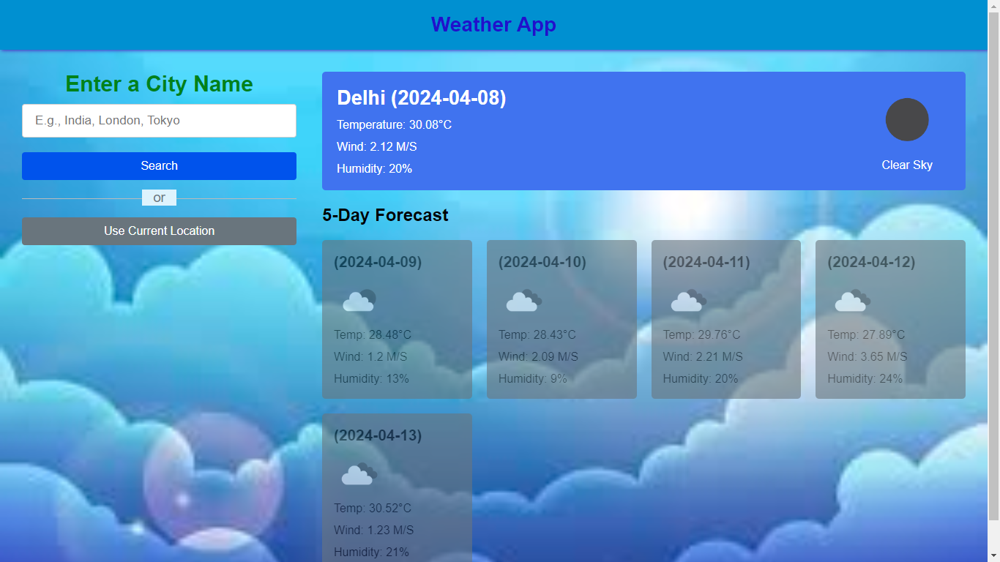
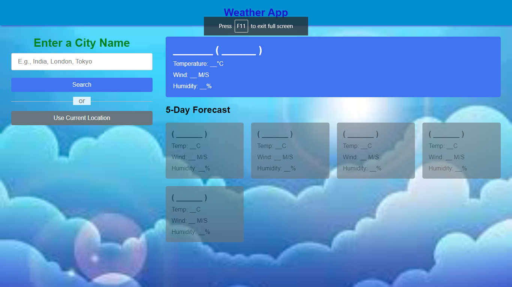

# Weather App

This is a simple weather app that provides current weather information for a specified location. It's built using HTML, CSS, and JavaScript.

## Features

- **Current Weather:** Get the current weather conditions including temperature, humidity, wind speed, and description.
- **Location-Based:** Automatically detects your current location or allows you to search for any location worldwide.
- **Responsive Design:** Works well on various devices including desktops, tablets, and mobile phones.

## How to Use

1. Clone this repository to your local machine.
2. Open the `index.html` file in your web browser.
3. Allow location access if prompted or manually search for a location.
4. View the current weather information displayed on the screen.

## Technologies Used

- HTML
- CSS
- JavaScript
- [OpenWeather API](https://openweathermap.org/api): Used to fetch weather data.

## Screenshots

## Contributing

Contributions are welcome! Please feel free to submit issues and pull requests.
